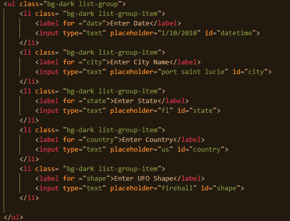
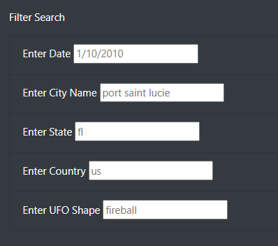
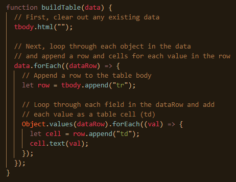
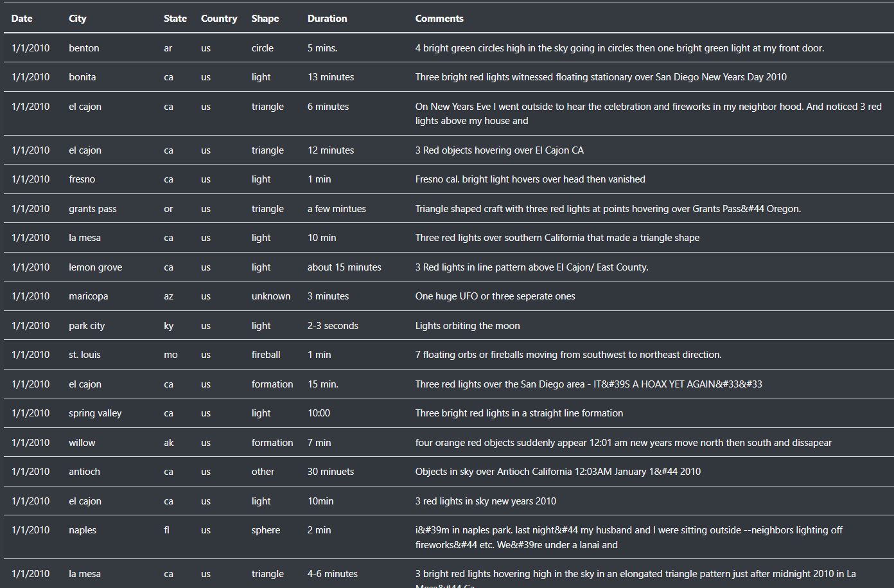
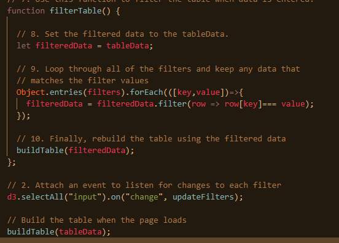
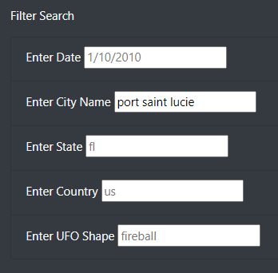
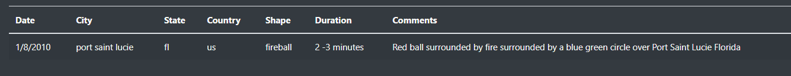
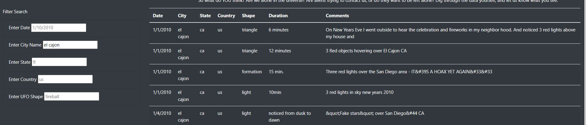
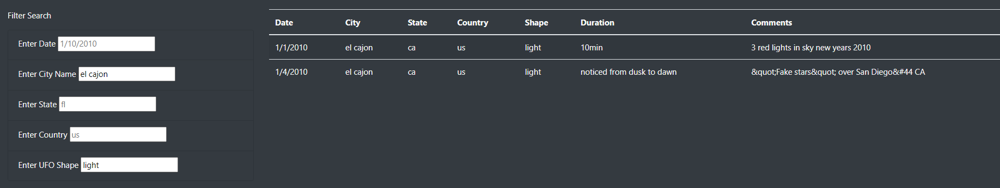

# UFOs
Module11 JavaScript

Link to deployed UFO webpage can be found here: 

https://cthompsonlbi.github.io/UFOs/

## Overview of Project:
The overview of this project is to take a website that accepts a single input field to filter data and expand it to allow the user to filter UFO sighting data using multiple critieria's.  Instead of having just the option to search for UFO sightings based on date, we will be adding the ability to search for UFO sightings based on date, city, state, country, and/or shape.  We will achieve this by using JavaScript, CSS and HTML.
### Purpose:
The purpose of this project is to assist Dana in allowing users to sort through the available data by searching on multiple parameters so that the user can review the UFO sighting data and decie for themselves what may be real UFO sightings and what may be a government conspiracy.  Walking Dana through the webpage with the new upgrades that allow be better search flexibility by allow to filter using multiple parameters, she will see the following upon loading the webpage:

* By modifying the Index HTML file as shown below, we can set the webpage up to handle 5 inputs:

* When loaded, the user will see five input fields to help them search for specific UFO sightings.

* The table will be built using the function created below:

* The table will be fully populated upon the loading of the webpage

* Now the code below, using d3.selectAll will detect and change to the input field and store it to the filters variable and later update the table using the update Filters Function.

* One example of this code in action is by filter upon my hometown of Port St. Lucie Fl.  As you see below, Port St Lucie we entered into the field:

* The result of that search lead to only one UFO sighting that met the requirement of Port St. Lucie

* Now, let's repeat this but changing the city from Port St. Lucie to El Cajon. Now you can see mulitple sighting returned by looking at the image below.

* To take this one step further, we can filter further to specifically look at sightings in El Cajon that have a shape of 'light'.  By modifying the 'city' field to El Cajon and the 'shape' field to return sightings characterized as lights, we see the following returned:

## Results:

The result is a visually appealing webpage with nice functionality.  It is user friendly and inviting and has the look and feel of well thoughtout and designed webpage.  It is able to handle multiple inputs and can filter data based upon those inputs.  It delivers upon all of Dana's requests and requirements.

## Summary:
This was an interesting project and learned a lot.  One of the drawbacks that I saw from a user perspective is there is nothing in place to notify whether or not a parameter like, date, city, or country that is entered is valid.  Another drawback would be the formatting of the inputs.  Meaning the state, country, and dates need to be inputed exactly as it is stored in the data file.  To address this there are a couple of approaches that could be implemented.  The first being error messaging.  If an user inputs and invalid date, city, country or shape or the input does not exist, a message should return stating that the "Input entered by the user does not exist, please modify your input and try again".  Adding some "smarts" that handle date formatting, capitilizations, and abbreviations for countries would be a nice add on feature to make the user experience better. A second option is to offer to return data based on a date range, or a radius.  If the user of the website did not put in a location that is present in the list of available data, it could return filtered data based on dates plus or minus seven days or if a city that is inputed by the user does not return an exact match then a radius option can be selected to return locations within the selected radius.
